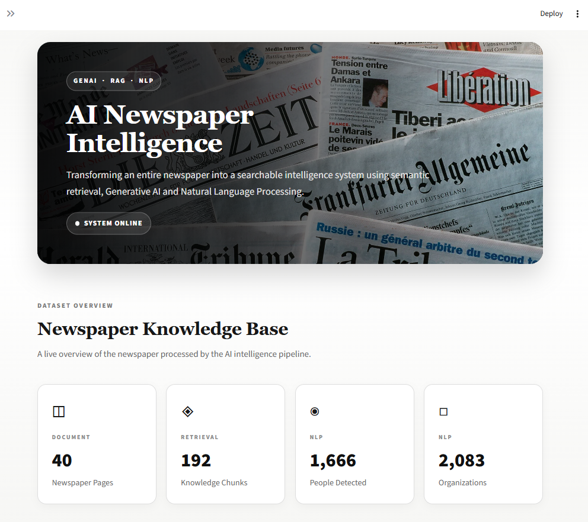
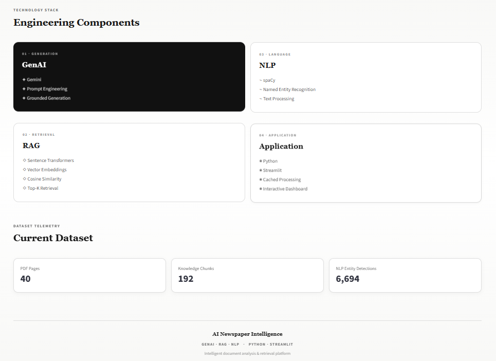
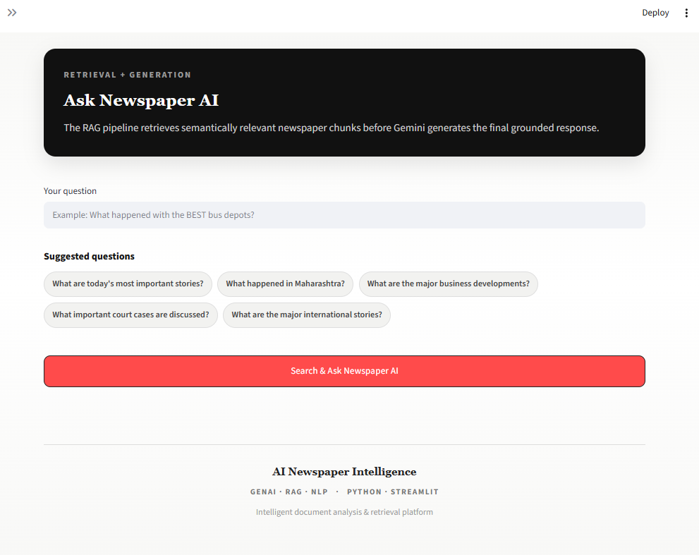
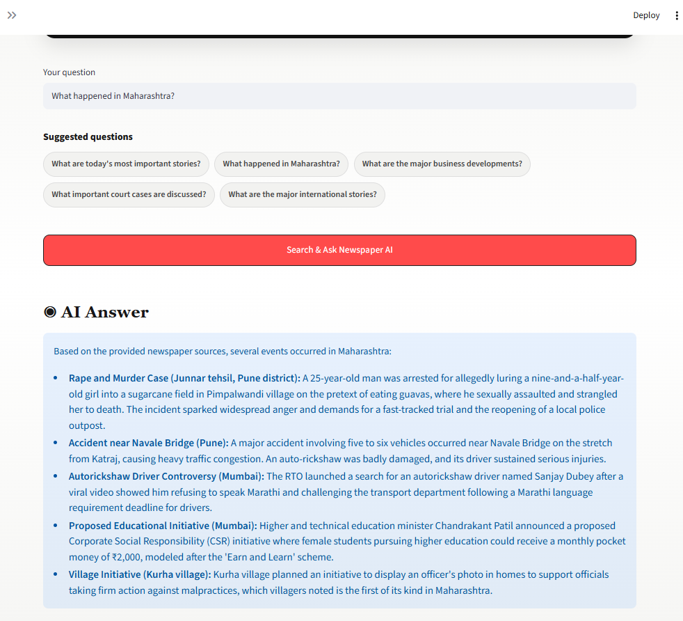
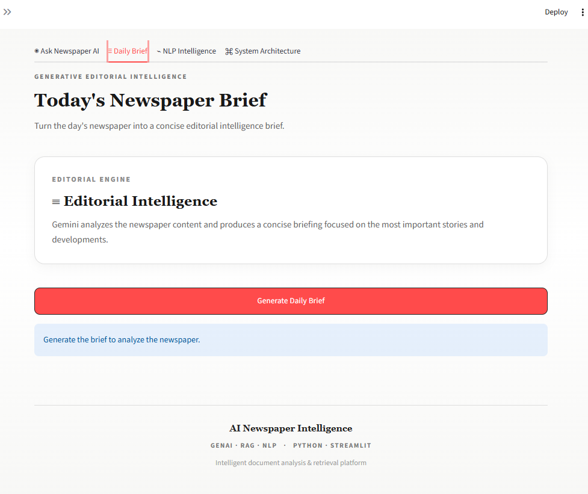
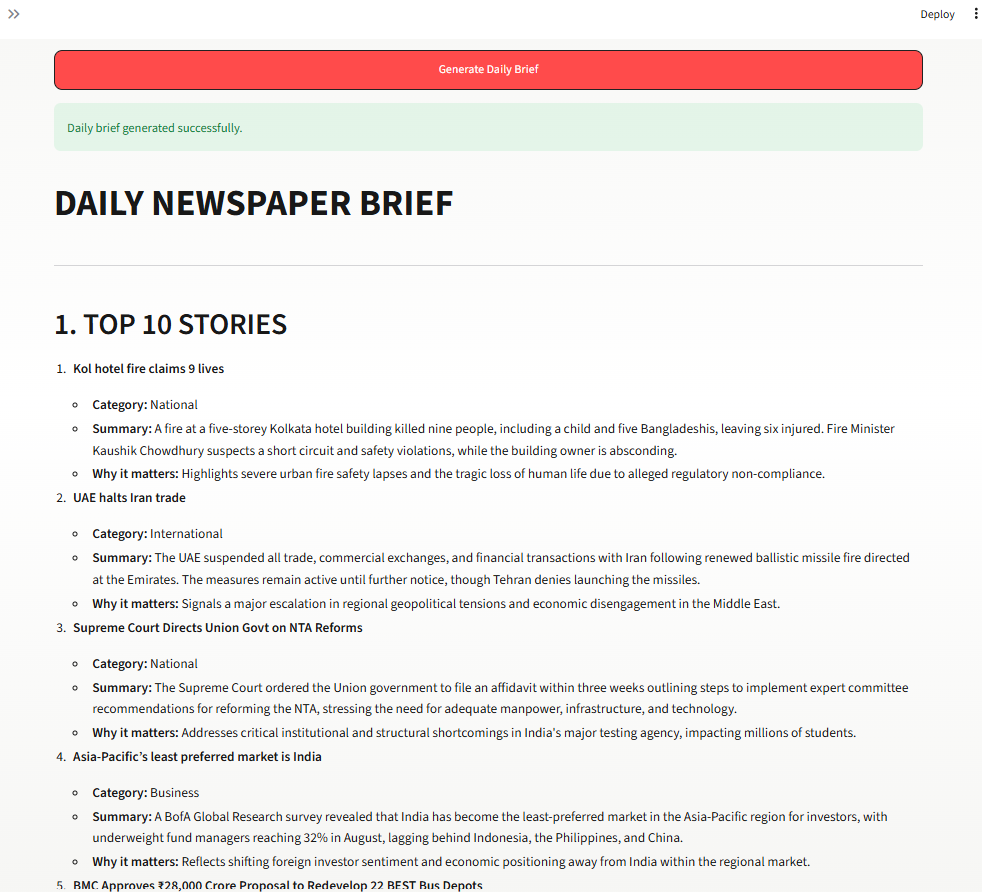
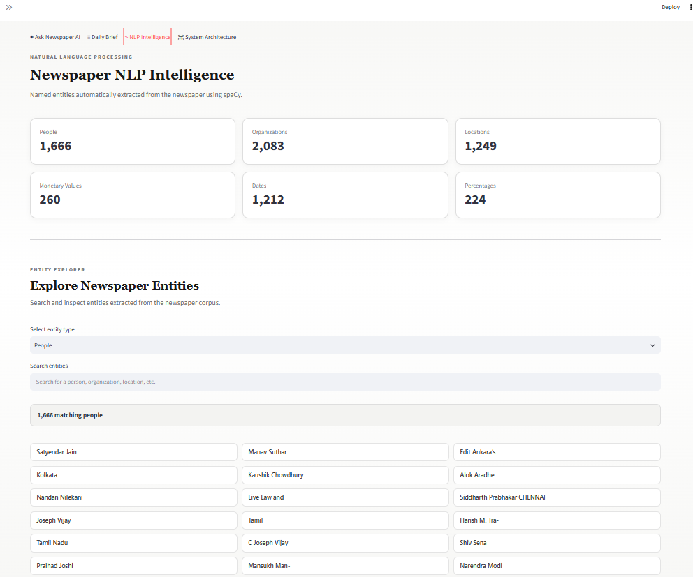
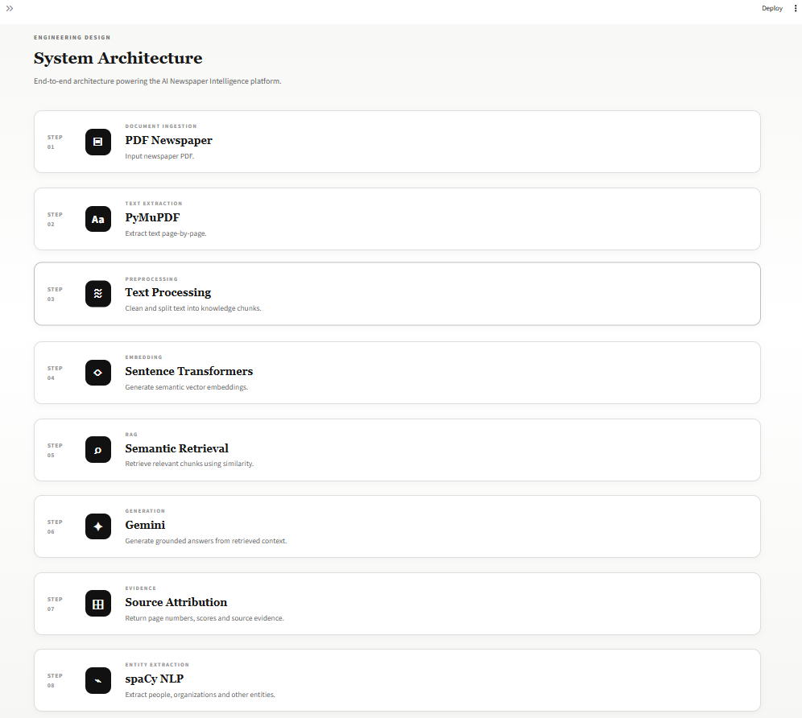

# 📰 AI Newspaper Intelligence

> A document intelligence system that turns a complete newspaper PDF into a searchable knowledge base using semantic retrieval, Gemini-powered generation, and spaCy-based NLP.

<p align="center">
  
</p>

<p align="center">
  <strong>GenAI · RAG · NLP · Document Intelligence</strong>
</p>

<p align="center">
  
  
  
  
  
</p>

---

## Overview

**AI Newspaper Intelligence** converts an entire newspaper PDF into an interactive knowledge system.

Instead of manually searching through dozens of pages, the application allows users to:

* ask questions about the newspaper
* retrieve semantically relevant passages
* generate grounded answers using Gemini
* inspect the evidence behind an answer
* generate an editorial-style newspaper brief
* extract and explore named entities using NLP

The current sample newspaper contains **40 pages**, which are transformed into **192 knowledge chunks** for semantic retrieval.

---

## What the system does

### 01 · Ask Newspaper AI

A natural-language question is converted into an embedding and compared against the newspaper knowledge base.

The system retrieves the most relevant chunks and passes that context to Gemini before generating the final response.

Each answer can be inspected through its retrieved sources, including:

* newspaper page number
* similarity score
* chunk identifier
* retrieved source text

This keeps the generation layer connected to the source document rather than treating Gemini as a standalone chatbot.

---

### 02 · Daily Newspaper Brief

The application can generate an editorial-style briefing from the processed newspaper.

The summarization pipeline identifies important content and passes it through the Gemini generation layer to produce a structured daily brief.

The output is designed to surface:

* major stories
* important developments
* recurring themes
* key takeaways

---

### 03 · NLP Intelligence

The complete newspaper text is also analyzed using **spaCy Named Entity Recognition**.

The current document produces the following entity detections:

| Entity type          | Detections |
| -------------------- | ---------: |
| People               |      1,666 |
| Organizations        |      2,083 |
| Locations            |      1,249 |
| Monetary Values      |        260 |
| Dates                |      1,212 |
| Percentages          |        224 |
| **Total detections** |  **6,694** |

The application provides an Entity Explorer for inspecting the extracted results by category.

> Entity counts represent detections returned by the NLP pipeline, not necessarily unique real-world entities.

---

# Architecture

```text
                    ┌─────────────────────┐
                    │   Newspaper PDF     │
                    └──────────┬──────────┘
                               │
                               ▼
                    ┌─────────────────────┐
                    │      PyMuPDF        │
                    │   Text Extraction   │
                    └──────────┬──────────┘
                               │
                               ▼
                    ┌─────────────────────┐
                    │  Text Processing    │
                    │     Chunking        │
                    └──────────┬──────────┘
                               │
                               ▼
                    ┌─────────────────────┐
                    │ Sentence Transformers│
                    │     Embeddings      │
                    └──────────┬──────────┘
                               │
                               ▼
                    ┌─────────────────────┐
                    │ Semantic Retrieval  │
                    │  Cosine Similarity  │
                    └──────────┬──────────┘
                               │
                               ▼
                    ┌─────────────────────┐
                    │       Gemini        │
                    │ Grounded Generation │
                    └──────────┬──────────┘
                               │
                               ▼
                    ┌─────────────────────┐
                    │ Source Attribution  │
                    │ Pages + Evidence    │
                    └─────────────────────┘


         ┌──────────────────────────────────────┐
         │              NLP Layer               │
         │                                      │
         │ Newspaper Text → spaCy → NER         │
         │                                      │
         │ People · Organizations · Locations   │
         │ Dates · Money · Percentages          │
         └──────────────────────────────────────┘
```

---

# Retrieval pipeline

The RAG workflow is intentionally straightforward:

```text
User Question
      │
      ▼
Question Embedding
      │
      ▼
Similarity Search
      │
      ▼
Top-K Newspaper Chunks
      │
      ▼
Relevance Threshold
      │
      ▼
Gemini Prompt + Retrieved Context
      │
      ▼
Grounded Answer
      │
      ▼
Supporting Sources
```

The current implementation retrieves the top relevant chunks and applies a similarity threshold before passing the context to the generation layer.

---

# Technology stack

| Layer               | Technology            | Purpose                                     |
| ------------------- | --------------------- | ------------------------------------------- |
| Interface           | Streamlit             | Interactive web application                 |
| Document processing | PyMuPDF               | Page-level PDF text extraction              |
| Chunking            | Python                | Convert extracted text into retrieval units |
| Embeddings          | Sentence Transformers | Semantic representation of text             |
| Retrieval           | Cosine Similarity     | Rank relevant newspaper chunks              |
| Generation          | Google Gemini         | Grounded answer generation                  |
| NLP                 | spaCy                 | Named Entity Recognition                    |
| Language            | Python                | Application and processing pipeline         |

### Embedding model

```text
all-MiniLM-L6-v2
```

The model is used to create semantic embeddings for both newspaper chunks and user questions.

---

# Project structure

```text
ai-newspaper-intelligence/
│
├── screenshots/
│   ├── newspaper-banner.png
│   ├── dashboard.png
│   ├── ask-newspaper-ai.png
│   ├── retrieved-sources.png
│   ├── daily-brief.png
│   ├── nlp-intelligence.png
│   ├── entity-explorer.png
│   └── architecture.png
│
├── data/
│   └── Free-Press-Journal-Mumbai-Epaper-20-08-2026.pdf
│
├── app.py
├── pdf_processor.py
├── rag.py
├── retriever.py
├── qa.py
├── llm.py
├── nlp_processor.py
├── summarizer.py
├── final_editor.py
├── prompts.py
│
├── .env.example
├── .gitignore
├── .gitattributes
├── LICENSE
├── requirements.txt
└── README.md
```

### Core modules

**`app.py`**
Streamlit application and interface.

**`pdf_processor.py`**
Extracts newspaper text page-by-page and creates retrieval chunks.

**`rag.py`**
Creates semantic embeddings for the newspaper chunks.

**`retriever.py`**
Performs similarity-based retrieval.

**`qa.py`**
Connects retrieval with question answering and source attribution.

**`llm.py`**
Handles Gemini interaction.

**`prompts.py`**
Contains prompts used by the generation workflows.

**`summarizer.py`**
Builds the newspaper summarization pipeline.

**`final_editor.py`**
Combines generated summaries into the final editorial output.

**`nlp_processor.py`**
Runs spaCy-based entity extraction.

---

# Getting started

## 1. Clone the repository

```bash
git clone https://github.com/rachitkumar-eng/ai-newspaper-intelligence.git

cd ai-newspaper-intelligence
```

## 2. Create a virtual environment

### Windows

```bash
python -m venv .venv
.venv\Scripts\activate
```

### macOS / Linux

```bash
python3 -m venv .venv
source .venv/bin/activate
```

## 3. Install dependencies

```bash
pip install -r requirements.txt
```

## 4. Download the spaCy model

```bash
python -m spacy download en_core_web_sm
```

## 5. Configure Gemini

Create a local `.env` file from the example:

```bash
copy .env.example .env
```

Add your Gemini API key:

```env
GEMINI_API_KEY=your_api_key_here
```

Never commit the `.env` file.

## 6. Verify the newspaper path

The application currently expects the sample newspaper at:

```text
data/Free-Press-Journal-Mumbai-Epaper-20-08-2026.pdf
```

If using a different newspaper PDF, update the configured PDF path in `app.py`.

## 7. Run the application

```bash
streamlit run app.py
```

The application will open in the browser.

---

# Example questions

The RAG interface works best with questions that can be answered from the newspaper itself.

### General

```text
What are the major stories in today's newspaper?
```

```text
What happened in Maharashtra?
```

```text
What are the most important national developments?
```

### Politics

```text
What did the newspaper report about Narendra Modi?
```

```text
What political developments were reported in Maharashtra?
```

### Business

```text
What are the major business stories?
```

```text
What companies or organizations were mentioned in the business news?
```

### Local news

```text
What happened in Mumbai?
```

```text
What developments were reported around Chembur?
```

### Courts / policy

```text
What did the newspaper report about the Supreme Court?
```

```text
What legal or policy developments were highlighted?
```

### International

```text
What are the major international stories?
```

```text
Which countries were prominently mentioned?
```

### Evidence-oriented questions

```text
What did the newspaper report about BEST bus depots?
```

```text
Which page discusses the reported development?
```

```text
What organizations were mentioned in the article about this issue?
```

The strongest questions are specific enough to match the newspaper content while still requiring semantic retrieval.

---

# Dataset snapshot

The sample newspaper processed by the application contains:

```text
40        PDF pages
192       knowledge chunks
1,666     people detections
2,083     organization detections
1,249     location detections
260       monetary value detections
1,212     date detections
224       percentage detections
──────────────────────────────
6,694     total NLP detections
```

These figures describe the current sample document and may change when another newspaper is processed.

---

# Application views

### Newspaper overview

<p align="center">
  
</p>

### Engineering Components

<p align="center">
  
</p>

### Ask Newspaper AI

<p align="center">
  
</p>

### Retrieved evidence

<p align="center">
  
</p>

### Daily brief

<p align="center">
  
</p>
<p align="center">
  
</p>

### NLP intelligence

<p align="center">
  
</p>

### System architecture

<p align="center">
  
</p>

---

# Design decisions

### Why semantic retrieval?

Keyword matching can miss relevant passages when the wording of a question differs from the wording used in the newspaper.

Semantic embeddings allow the retrieval layer to compare meaning rather than relying only on exact words.

### Why retrieve before generation?

The retrieval layer provides the generation model with document-specific context.

This reduces the need for the model to rely solely on its pretrained knowledge and makes the answer traceable to the processed newspaper.

### Why show similarity scores?

The score provides visibility into which chunks were considered relevant by the retrieval layer.

It also makes the RAG pipeline inspectable instead of hiding retrieval behind the interface.

### Why include NLP separately?

RAG answers questions about document content, while NER provides a different way to explore the document.

Together they create two complementary interfaces:

```text
Question → Retrieval → Answer

Document → NLP → Entities
```

---

# Limitations

This project is designed as a document-intelligence portfolio application rather than a production newspaper ingestion platform.

Current limitations include:

* the sample workflow processes a provided newspaper PDF rather than continuously ingesting new editions
* entity extraction depends on spaCy's NER model and can contain noisy or duplicated detections
* PDF text extraction quality depends on the source document
* retrieval quality depends on chunking, embeddings and similarity thresholds
* Gemini generation requires an API key and may incur API usage costs
* the current retrieval implementation is optimized for a document of this scale rather than a large distributed corpus

These limitations are intentional boundaries of the current implementation.

---

# What this project demonstrates

This project brings together several parts of a modern AI data pipeline:

```text
Document Processing
        ↓
Text Transformation
        ↓
Semantic Representation
        ↓
Information Retrieval
        ↓
Context Grounding
        ↓
Generative AI
        ↓
Source Attribution
        ↓
NLP Intelligence
        ↓
Interactive Application
```

The focus is not simply on generating text with an LLM, but on building the surrounding pipeline required to make a document-based AI application useful and inspectable.

---

## Project status

**Current status:** Complete portfolio implementation

**Primary focus:** Document intelligence, RAG, NLP and Generative AI

**Interface:** Streamlit

**Sample document:** 40-page newspaper PDF

---

<p align="center">
  <sub>AI Newspaper Intelligence · GenAI + RAG + NLP</sub>
</p>
